# Display Flexbox

Como ya vimos en esta otra [sección ](https://github.com/uqbar-project/css-03-display-basico), en CSS3 disponemos de distintos tipos de modelos de layout, y cada uno aporta sus propiedades específicas, para definir cómo se muestran los elementos y cómo se relacionan con el resto.

En esta oportunidad vamos a ver las principales características del **Display Flexbox** y cómo nos da un control completo sobre la **alineación, dirección, orden y tamaño** de nuestros elementos.

## Contenedor Flexible e Ítems Flexibles

Para comenzar a usar el modelo de _"caja flexible"_, es necesario definir nuestro **contenedor flexible**. Este se va a encargar de agrupar nuestros **ítems flexibles** y definir cómo se posicionan.

Cada elemento HTML que es un hijo directo de un contenedor flexible, es un **ítem flexible**.

## Eje Principal y Eje Secundario

Veamos esta imagen, y pasemos a explicar un poco.


Los contenedores flexibles tienen dos ejes. El **eje principal (main axis)** y el **eje secundario (cross axis)**. Por default el eje principal, es el horizontal, y el secundario el vertical. Más adelante veremos como esto lo podemos modificar, para que el principal sea vertical y el secundario horizontal.

Estos ejes, nos sirven para determinar el modo en que vamos a posicionar los ítems flexibles. Por ejemplo si el eje principal es horizontal, los ítems se pondrán uno al lado del otro. Si el eje principal fuera vertical, los ítems se colocarían uno debajo del otro.

A la hora de alinear un texto, por ejemplo, con CSS tenemos los conceptos left y right, indicando que queremos una alineación a izquierda o derecha. Esto no funciona justamente igual en Flexbox. En este caso tenemos los conceptos de **inicio** y **fin** (start / end).
Ambos conceptos están presentes tanto en el eje principal como en el eje secundario, es decir, existirá un inicio y un fin para cada uno de los ejes.

En Flexbox, las dimensiones continúan siendo la altura y la anchura, definidas con _width_ y _height_. Sin embargo, la principal de estas dimensiones dependerá de cuál de sus ejes sea el principal. _Ejemplo: si la dirección es de arriba a abajo, entonces la dimensión principal será la altura._

## El ejemplo

El ejemplo que presentamos es simple, pero nos permite utilizar las propiedades más importantes de Flexbox.

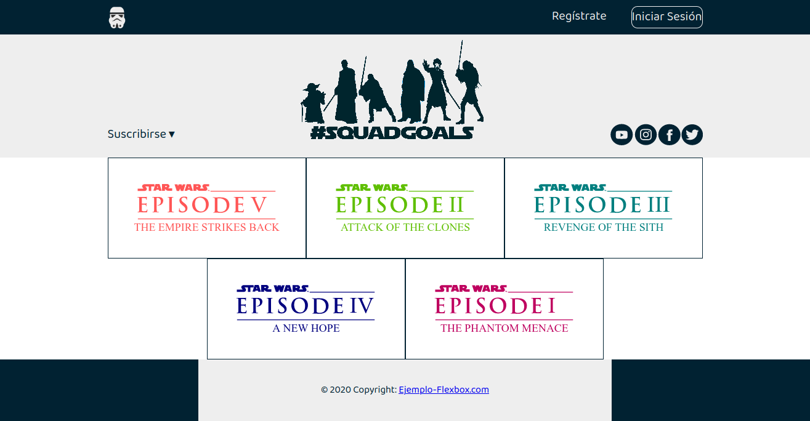

## Contenedores Flexibles

Algo ya comentamos sobre ellos, pero ahora los vamos a implementar.
Para comenzar a usar Flexbox, tenemos que convertir uno de nuestros elementos HTML en un contenedor flexible. Para ello vamos a utilizar la propiedad `display` que vimos [anteriormente ](https://github.com/uqbar-project/css-03-display-basico), pero esta vez con el valor **flex** o **inline-flex**.

En el archivo `estilos.css` ponemos:

```css
.nav-container {
  font-size: 20px;
  color: var(--color-secundario);
  background-color: var(--color-primario);
  padding: 10px 0;
  display: flex;
}
```

y en `ejemplo.html` :

```html
<nav class="nav-container">
  <div class="nav">
    
    <div>Regístrate</div>
    <div class="iniciar-sesion">Iniciar Sesión</div>
  </div>
</nav>
```

Bien, tenemos un contenedor flexible con un articulo flexible, pero nuestra página se ve igual que antes.
Lo que hicimos es habilitar el modo de diseño de flexbox: sin él, el navegador ignoraría todas las propiedades de flexbox que estamos por usar.

### Empecemos a Alinear los Ítems Flexibles

#### Alineación Eje Principal

La propiedad **justify-content** nos permite alinear los ítems en la dirección del **eje principal** (recordemos que por default es en la dirección horizontal).
Veamos cómo funciona, centremos nuestro ítem flexible:

```css
.nav-container {
  /* ... */
  justify-content: center;
}

.nav {
  border: 1px solid white; /* Lo agregamos temporalmente para ver el efecto */
  width: var(--ancho-default);
}
```

Es importante destacar cómo lo hicimos, agregando una propiedad al elemento principal (el contenedor flexible) en lugar de directamente al elemento que queríamos centrar (el elemento flexible). Manipular elementos a través de sus contenedores, es un tema común en flexbox, y es un poco diferente de cómo hemos estado posicionando cajas hasta ahora.

Los valores que le podemos dar a **justify-content** son:

- center
- flex-start
- flex-end
- space-around
- space-between

Veamos el efecto de alguno de ellos ...

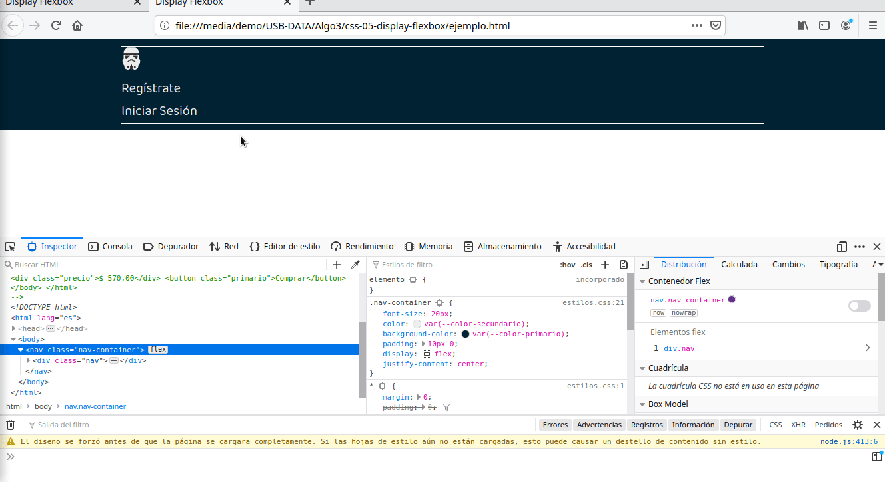

Puede que todavía no nos veamos sorprendidos, porque una de las fortalezas de flexbox se nota cuando tenemos varios ítems flexibles y queremos distribuirlos dentro del contenedor.

Agregamos un poco más ...

```css
.nav {
  /* ... */
  display: flex;
  justify-content: space-between;
}
```

Esto convierte nuestro `.nav` en un contenedor flexible anidado, y el valor _space-between_ distribuye el espacio no utilizado por los ítems, agregándolo entre ellos.
El _space-around_ es similar solo que distribuye el espacio, ubicándolo alrededor de ellos como vemos en la siguiente imagen.


En el ejemplo final, terminamos el navbar aplicando estas mismas propiedades.

#### Alineación Eje Secundario

Con lo que vimos hasta ahora, somos capaces de ubicar nuestros ítems en la dirección del eje principal, pero nuestros contenedores flexibles también pueden posicionar sus ítems a lo largo del **eje secundario** (por default con dirección vertical), para eso debemos agregar la propiedad **align-items**, que acepta estos valores.

- center
- flex-start
- flex-end
- stretch
- baseline

Para poder verlo sigamos con el ejemplo y agreguemos un `header`...

```html
<header class="header-container">
  <div class="header">
    <div class="suscribirse">Suscribirse &#9662;</div>
    
    
  </div>
</header>
```

... y sus estilos.

```css
.header-container {
  font-size: 20px;
  color: var(--color-primario);
  background-color: var(--color-secundario);
  display: flex;
  justify-content: center;
}

.header {
  width: var(--ancho-default);
  height: 200px;
  display: flex;
  justify-content: space-between;
}
.logo {
  width: 300px;
  height: 200px;
  filter: var(--filtro-color-primario);
}
```

¿No se parece a lo que ya hicimos en el navbar?
Un poco sí, pero la diferencia es que `.header`
tiene la propiedad _height_ definida, lo que hace que el contenedor flexible, se extienda en altura.

Veamos lo que sucede

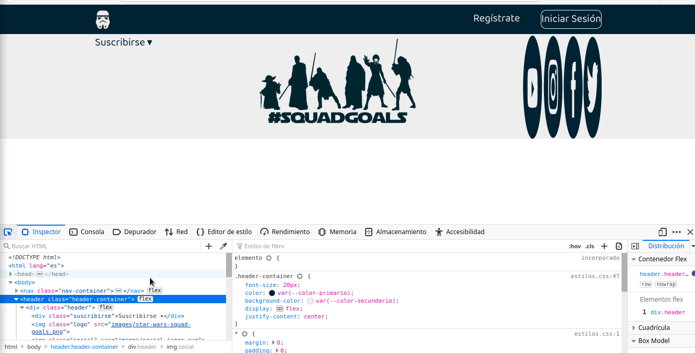

¿Por qué pasan cosas distintas con los 3 ítems?

- El _suscribirse_ es un texto y aún no tenemos la class de css definida, lo mismo ocurre con los logos de las redes sociales, pero ¿por qué uno se estira y el otro no? Porque los logos son una imagen y, cuando definimos el contenedor como flexible, por default la propiedad align-items es _stretch_, esto hace que la imagen se estire al tamaño de su caja flexible, pero no ocurre con los textos, su caja toma todo el tamaño del alto, y el texto no se expande.

- ¿Pero por qué el logo central, que es una imagen, no se estiró? porque en `.logo` definimos sus tamaños, por eso no se estira al tamaño de su caja.

- Como dijimos recién, _stretch_ es el valor default de _align-items_, al setearlo explícitamente, no sucedió nada, pero cuando cambiamos a _center_ se alinearon verticalmente los 3 ítems.

OK, editamos `estilos.css`, para reflejar lo que vimos en el navegador.

```css
.header {
  /* ... */
  align-items: center;
}
```

Hay más para comentar con respecto a la alineación con el eje secundario, pero necesitamos ver otros temas antes.

#### Construir _"Grillas"_ con Flexbox

Si recordamos la imagen del [ejemplo](#El-ejemplo), teníamos una grilla con unas fotos.

Comencemos a diseñarla.

```html
<div class="foto-grid-container">
  <div class="foto-grid">
    <div class="foto-grid-item first-item">
      
    </div>
    <div class="foto-grid-item">
      
    </div>
    <div class="foto-grid-item">
      
    </div>
  </div>
</div>
```

```css
.foto-grid-container {
  display: flex;
  justify-content: center;
}

.foto-grid {
  width: var(--ancho-default);
  display: flex;
  justify-content: flex-start;
}

.foto-grid-item {
  border: var(--border-default);
  width: 322px;
  padding: 40px;
}

.foto-grid-item > img {
  width: 240px;
  height: 82px;
}
```

Por ahora todo va bien, pero si agregamos más ítems nos pasa lo siguiente.

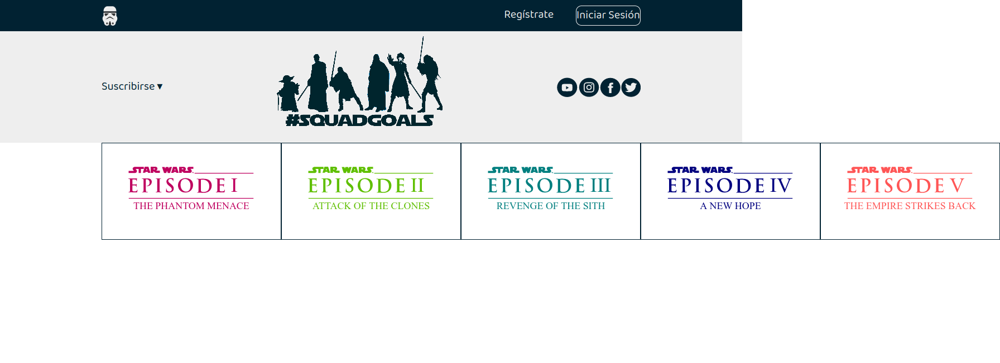

Los ítems no entran en el contenedor flexible, y por default flexbox ubica los ítems uno a continuación del otro en la dirección del eje principal, provocando el desbordamiento.
La propiedad **flex-wrap** con el valor `wrap`, evita la situación anterior, y genera la cantidad de filas o columnas ( dependiendo si el eje principal es horizontal o vertical) necesarias para que no se desborden los ítems.

Hagamos eso ...

```css
.foto-grid {
  /* ... */
  justify-content: center; /* solo le cambiamos el valor por center */
  flex-wrap: wrap;
}
```

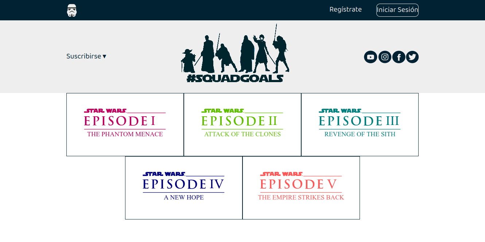

Los valores que acepta **flex-wrap** son:

- nowrap
- wrap
- wrap-reverse (invierte el orden de las filas)

#### Dirección de los contenedores

Hasta el momento todos nuestros contenedores tienen la dirección _horizontal_ que es la default.
Probemos la propiedad **flex-direction** para modificarla.

```css
.foto-grid {
  /* .... */
  flex-direction: column;
}
```

Conseguimos cambiar nuestra grilla a una sola columna, solo con modificar el valor de esa propiedad a `column` (por default era `row`).

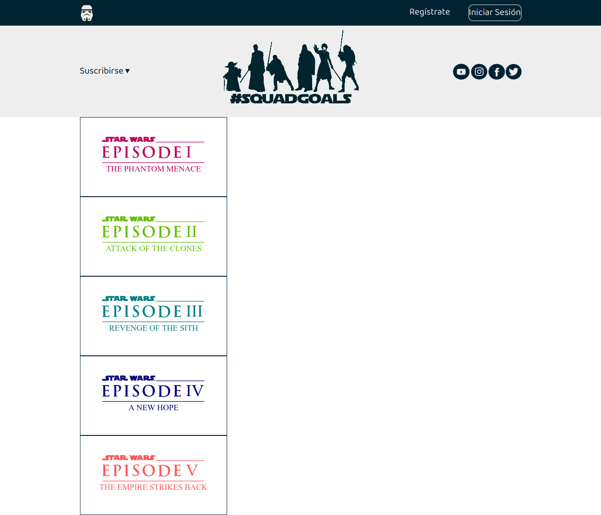

Bien, pero la columna no se encuentra centrada, ¿Por qué?
La respuesta la vimos cuando hablamos de la [alineación del eje principal](#Alineación-Eje-Principal) y [del eje secundario](#Alineación-Eje-Secundario).

**justify-content** solo alinea en la dirección del eje principal, y cuando cambiamos a `flex-direction:column`, cambiamos el contexto de nuestro contenedor, haciendo que justify-content cause efecto en la dirección vertical.

Entonces para centrarla debemos agregar **align-items** con el valor `center`, ya que buscamos centrarla en el eje secundario.

```css
.foto-grid {
  /* ... */
  align-items: center;
}
```

Los valores que podemos darle a **flex-direction** son:

- row
- column
- row-reverse
- column-reverse

#### Líneas de Inicio y de Fin : row-reverse y column-reverse

Hasta ahora tuvimos una relación estrecha entre el orden de los elementos en el HTML y la forma en que los mismos se representan en la página web.

Veamos los efectos de usar **row-reverse** y **column-reverse**

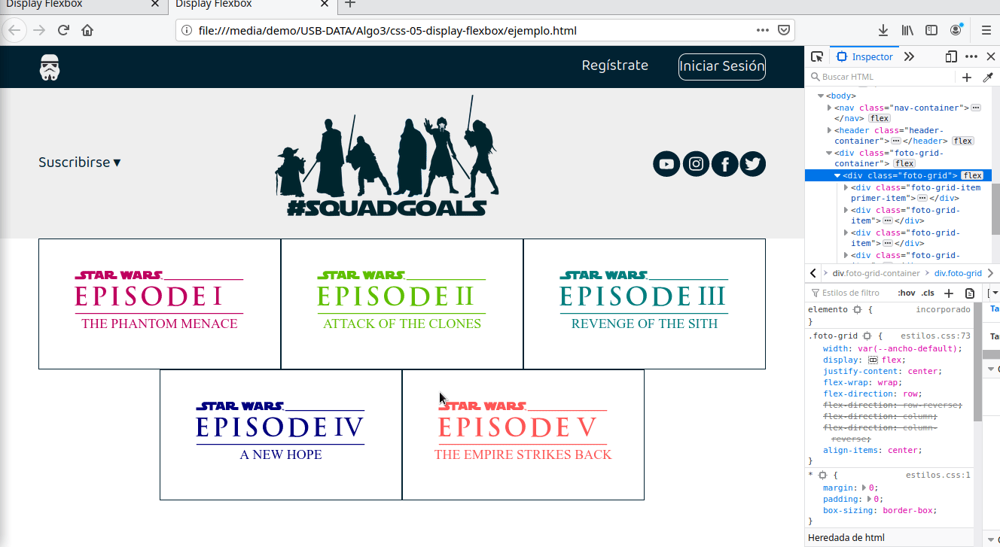

En la disposición del HTML, los episodios de Star Wars, respetan el orden numérico. Cuando aplicamos `row-reverse` o `column-reverse`, se cambia el orden por fila (o columna). En el caso de `row-reverse` ambas filas se representan de _derecha a izquierda_ en vez de izquierda a derecha.

Gráficamente es como, si por cada caso, la [imagen](#Eje-Principal-y-Eje-Secundario) que mostramos al principio girase 90°.

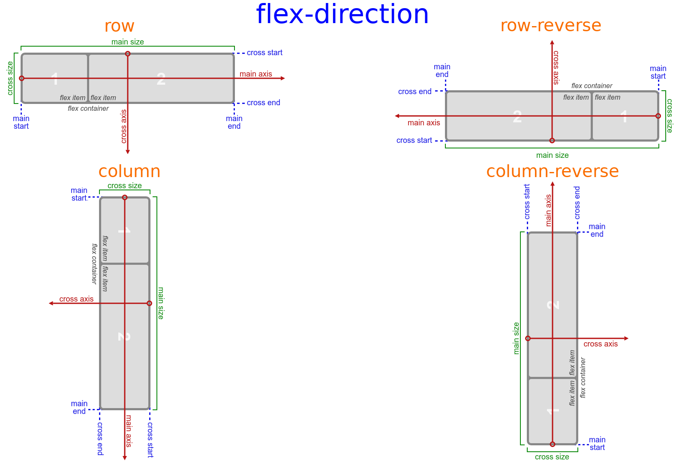

Los métodos modernos de layout acogen la totalidad de modos de escritura así que no es necesario asumir que una línea de texto empezará arriba del documento y correrá de izquierda a derecha, con nuevas líneas dispuestas una abajo de la otra.

La siguiente descripción debería ayudar para explicar porqué no se habla de izquierda y derecha ni de arriba o abajo a la hora de describir la dirección en la que fluyen los ítems flexibles.

Si `flex-direction` es `row` y estamos trabajando en español, entonces el margen inicial del eje principal quedará a la izquierda, y el margen final a la derecha.


Si fueramos a trabajar en árabe, entonces el margen inicial del eje principal quedaría a la derecha y el margen final a la izquierda.


En ambos casos el margen inicial del eje cruzado estará en el extremo superior del contenedor flexible y el margen final en el extremo inferior, ya que ambos idiomas tiene un modo de escritura horizontal.

El efecto de `row` y `row-reverse` dependerá del atributo `dir` (atributo que indica la dirección del modo de escritura), si es `ltr` (left to right), row representa el eje horizontal orientado de izquierda a derecha, y row-reverse desde la derecha hacia la izquierda; si el atributo dir es `rtl`, row representa el eje orientado de derecha a izquierda, y row-reverse de izquierda a derecha.


Es importante en cuanto a la **accesibilidad**, las consecuencias de utilizar flex-direction con un valor de `row-reverse` o `column-reverse` en elementos que necesitan foco (como botones). El orden de visualización será distinto al orden del DOM, por lo que los usuarios de lectores de pantalla no verán reflejado el mismo orden de los elementos que un usuario vidente. Para más información les dejamos este [artículo](https://tink.uk/flexbox-the-keyboard-navigation-disconnect/).

#### Continuación Alineación Eje Secundario: cuando tenemos más de una línea de ítems

Pocas lineas más [arriba](#Alineación-Eje-Secundario), contamos, cómo podíamos alinear en el _eje secundario_, pero todavía no contabamos con más de una linea de ítems.

Modifiquemos temporalmente nuestro ejemplo, para ver qué sucede, en dicha circunstancia.
Para ello vamos a darle un poco más de altura al contenedor.

```css
.foto-grid-container {
  /* ... */
  height: 500px; /* Agregado temporal*/
}
```
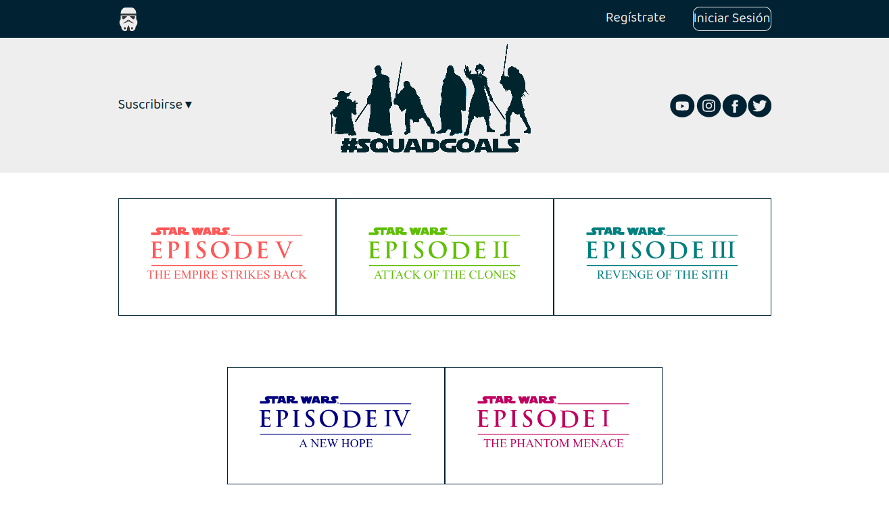

Observamos que, como ahora hay más espacio en el contenedor (con relacion al eje secundario), se distribuyen y se separan los ítems.

Para poder alinearlos, ya no nos sirve usar `align-items`.
Presentamos entonces **align-content**, que toma como valores:

- space-around
- space-between
- center
- flex-start
- flex-end
- stretch

Y estos son sus efectos ...
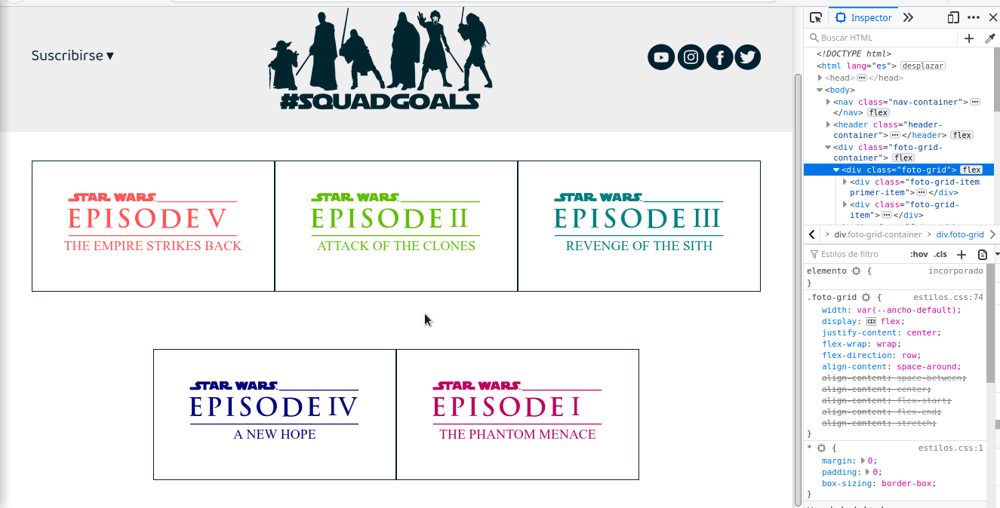


## Ítems Flexibles

Hasta el momento, manipulamos los **ítems flexibles**, desde propiedades aplicadas en sus contenedores principales. Pero también podemos hacerlo directamente sobre ellos.

### Ordenar Ítems Flexibles

Si agregamos la propiedad **order** a un **ítem flexible**, podemos definir su orden en el contenedor sin afectar los elementos circundantes. Por default todos los ítems tienen el valor de esta propiedad en `0`, aumentarlo o disminuirlo mueve al ítem desde la línea de inicio del eje principal hacia la del fin y viceversa, respectivamente. Ante igual valor de orden, se respeta el orden dispuesto en el HTML.

```css
.primer-item {
  order: 1;
}

.ultimo-item {
  order: -1;
}
```

### Alinear Ítems Flexibles ... pero esta vez especificando cuales.

Ya vimos como **align-items** alinea todos los ítems en el eje secundario desde el contenedor, pero si aplicamos **align-self** directamente en un ítem, podemos anular el efecto del primero e indicar la alineación de forma específica.

Cambiemos un poco el header

```css
.social,
.suscribirse {
  align-self: flex-end;
  margin-bottom: 20px;
}
```

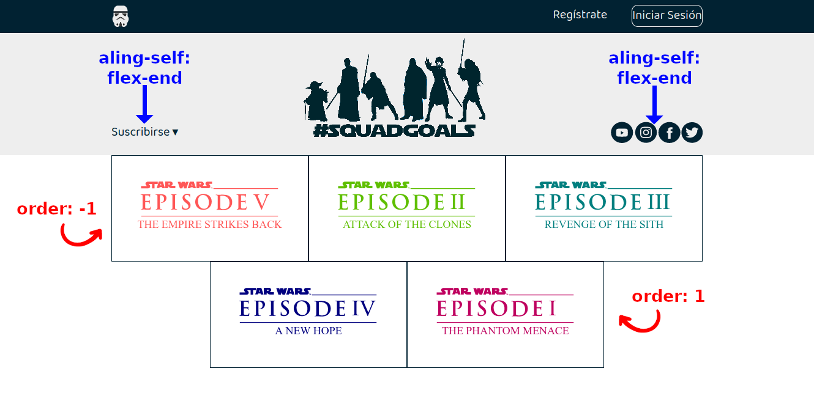

Las propiedades que acepta **align-self**, son las mismas que align-items:

- center
- flex-start
- flex-end
- stretch
- baseline

### Manejo de tamaños flexibles.

Además de permitirnos ordenar, distribuir y alinear nuestros ítems, Flexbox puede manipular los tamaños de los artículos, es por ello que los llamamos **artículos flexibles**.
Para esto nos brinda tres propiedades, que le indican cómo debe manejar el espacio disponible del contenedor (el que no usan los ítems), para ocuparlo; o qué debe hacer si el espacio del contenedor no es suficiente para alojarlos.

#### flex-grow

El valor que acepta es numérico (mayor o igual a cero). En base a este se determina cómo debe crecer el ítem. Un ítem con valor **cero** le dice a flexbox que **no debe crecer**.
Cuando el valor **es mayor a cero**, funciona como un peso que le dice al contenedor flexible cómo distribuir el espacio adicional a cada artículo. Por ejemplo, un elemento con un `flex-grow:2` crecerá dos veces más rápido que los elementos que tengan como valor 1.

#### flex-shrink

Similar a `flex-grow`, pero en vez de indicar el crecimiento, indica cómo debe achicarse el ítem, cuando el tamaño de los ítems supere al del contenedor, para evitar desbordamientos. A mayor valor, más se reduce. Por defecto todos los ítems tienen el valor 1.

#### flex-basis

Define el tamaño base de un ítem antes que el espacio disponible sea distribuido, por causa de otras propiedades como por ejemplo `flex-grow`.
Los valores aceptados son cualquier unidad de medida CSS, o palabras claves (auto, content,initial, inherit, unset, none ). Su valor default es `auto`.

#### flex

En general se suele usar el shorthand **flex** en lugar de `flex-grow`, `flex-shrink` y `flex-basis`. El segundo y tercer parámetro son opcionales ( tomarían los valores correspondientes a `flex-shrink` y `flex-basis`).
Cuando definimos un contenedor flexible, por default todos los ítems toman el valor `flex: 0 1 auto`, pero si se setea la propiedad con algún valor, los otros dos parámetros pasan a `1 0`.

Probemos cómo funciona, hagamos el footer.

```html
<footer class="footer">
  <div class="footer-item footer-izquierdo"></div>
  <div class="footer-item footer-central">
    <div>
      © 2020 Copyright:
      <a href="https://github.com/uqbar-project/css-05-display-flexbox">
        Ejemplo-Flexbox.com</a
      >
    </div>
  </div>
  <div class="footer-item footer-derecho"></div>
</footer>
```

```css
.footer {
  display: flex;
  justify-content: space-between;
}

.footer-item {
  border: 1px solid #fff;
  background-color: var(--color-primario);
  height: 100px;
  flex: 1;
}

.footer-central {
  color: var(--color-primario);
  background-color: var(--color-secundario);
}
```

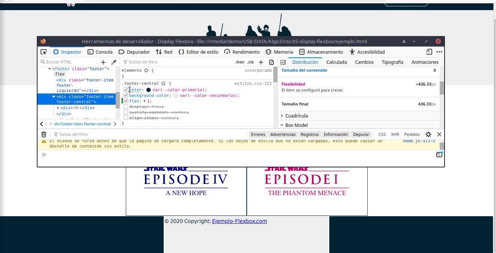

En la imagen vemos como los 3 ítems del footer se adaptan a medida que modificamos la propiedad `flex` de uno de ellos.

Hay veces que podemos necesitar que alguno de nuestros ítems conserve un tamaño fijo.
Hagamos que el footer tenga las cajas de los costados fijas y que solo la central sea flexible.

```css
.footer-izquierdo,
.footer-derecho {
  background-color: var(--color-primario);
  flex: 0 0 322px;
}
```


## Resumen

Flexbox a través de sus **contenedores** e **ítems flexibles**, nos brinda un conjunto de herramientas/características, que nos permiten ordenar, alinear, distribuir y modificar los tamaños, de nuestros elementos.
Para tener estos _"poderes"_ necesitamos convertir un elemento de nuestro HTML en un contenedor flexible:

- **display:flex** o **display:inline-flex**: habilitan el modo de layout de flexbox.

Vimos como muchas de las cosas que resuelve flexbox, se _"configuran"_ en los **contenedores**, para indicarle cómo queremos que se comporten los ítems que contienen.

- **justify-content**: define la alineación en el _eje principal_ y la distribución de los ítems a lo largo de este.
- **align-items** y **align-content**: definen la alineación en el _eje secundario_ y distribución a lo largo de este. Siendo el primero para cuando los ítems se representan en una única línea, y el segundo cuando tenemos más de una línea.
- **flex-wrap**: para indicar si los ítems deben ubicarse en una o más lineas.
- **flex-direction**: determina el _eje principal_ y la dirección en que se colocan los ítems dentro de los contenedores.

Mencionamos y probamos, cómo flexbox contempla el modo de escritura para establecer las líneas de **inicio** y **fin** en sus dos ejes.

Así como los contenedores juegan un papel importante en flexbox, los **ítems flexibles** también tienen lo suyo. Lo observamos cuando usamos las propiedades que les aplicamos directamente a ellos.

- **order**: controla el orden en que aparecen los ítems en el contenedor flexible, modificando el orden establecido por default en el HTML.
- **align-self**: establece la alineación en el _eje secundario_ para un ítem individual, pudiendo incluso anular lo establecido por `align-items`.
- **flex**: como propiedad abreviada de **flex-grow**, **flex-shrink** y **flex-basis**, nos deja configurar cómo queremos que se comporten los ítems dentro del contenedor, logrando, de ser necesario, que crezcan o reduzcan su **tamaño principal** (establecido por el _eje principal_), así como definir un tamaño base, antes de distribuir el espacio disponible en el contenedor.

## Material adicional

### Seguir aprendiendo con juegos y material interactivo

#### Juegos

- [Flexbox Froggy](https://flexboxfroggy.com/#es)
- [Flexbox Defense](http://www.flexboxdefense.com/)

#### Material interactivo

- [Flex Cheatsheet](https://yoksel.github.io/flex-cheatsheet/)
- [Codepen Flexbox Playground](https://codepen.io/enxaneta/full/adLPwv/)
- [Flexy Boxes](https://the-echoplex.net/flexyboxes/)
- [CSS Flexbox Please!](https://demo.agektmr.com/flexbox/)

### Material de lectura

- [W3: CSS Flexible Box Layout ](https://www.w3.org/TR/css-flexbox-1/)
- [Conceptos Básicos de Flexbox](https://developer.mozilla.org/es/docs/Web/CSS/CSS_Flexible_Box_Layout/Conceptos_Basicos_de_Flexbox)
- [MDN web docs: Flexbox ](https://developer.mozilla.org/es/docs/Learn/CSS/CSS_layout/Flexbox)
- [W3 Schools: CSS Flexbox](https://www.w3schools.com/css/css3_flexbox.asp)
- [CSS-Tricks: A Complete Guide to Flexbox](https://css-tricks.com/snippets/css/a-guide-to-flexbox/)
